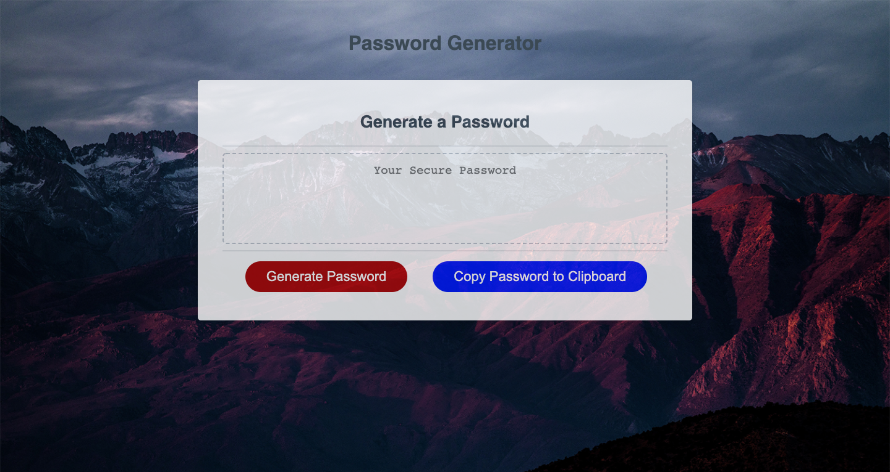

# RandomPasswordGenerator

## Description

This project utilizes dynamically updated `HTML` and `CSS` powered by `JavaScript` to create a random password generator application for an employee.  <i>The `HTML` and `CSS` code was provided for this project.  Minor additions were included in both files to produce the final project.</i>

## Task

The employee wants to randomly generate a password that meets certain criteria so that they can create a strong password that provides greater security.  The randomly generated password <i>must</i> be between 8 and 128 characters long, and <i>must</i> include at least one of four character type criteria:  lowercase, uppercase, numeric, and/or special characters.

The random password generator will create a password when the `Generate Password` button is clicked.  The following steps will then take place:

* A prompt will ask the employee how many characters they would like their password to be.

    * The employee must select a number that is a minimum length of 8 characters, and a maximum length of 128 characters.
    * If the employee does <i>not</i> select a number that is greater than or equal to 8, and less than or equal to 128, an alert will be triggered:  <i>"Sorry, please enter a number between 8 and 128."</i>  The application will then circle back to the starting point, and the employee will be required to click the `Generate Password` button again.
    * If the employee <i>does</i> select a number that is greater than or equal to 8, and less than or equal to 128, a set of confirmation statements will run:

        * <i>Would you like lowercase letters to be included in your password?</i>
        * <i>Would you like uppercase letters to be included in your password?</i>
        * <i>Would you like numbers to be included in your password?</i>
        * <i>Would you like special characters to be included in your password?</i>

    * The employee generating the password is required to select at least one of the four character type criteria when the application runs:  lowercase, uppercase, numeric, and/or special characters.

        * If the employee does <i>not</i> select one of the four character type criteria, an alert will be triggered:  <i>"Please select at least one type of character you would like to include!</i>  The application will then circle back to the starting point, and the employee will be required to click the `Generate Password` button again.
        * If the employee <i>does</i> select one of the four character type criteria, then a random password will be generated.
    
    * Once a random password has been generated, the employee may click the `Copy Password to Clipboard` button to copy the password and paste it for use wherever necessary.  An alert, <i>Password copied to clipboard.</i>, is displayed.

## Usage

This application can be used by employees to generate a random password that will be strong and provides greater security by meeting certain criteria, including length and character types used.

## Installation

This project will require a user to have:
* `Git Bash` (Windows), `Terminal` (Mac), or another application for executing commands to/from one's local machine.
* Code editor installed, such as `Visual Studio Code`.
* Version control system, such as `GitHub`, to fork, clone, push, and pull the original repository, and to upload the final project to one's own version control system account.

## Process

* This project began with three separate files that were provided:  `index.html`, `style.css`, and `script.js`
    * The `index.html` and `style.css` files included complete code.  The `script.js` file included some starter code, but most of the code needed to be written.
* A step-by-step outline was first sketched out to determine what needed to be included within the `script.js` file:

    * When the employee clicks `Generate Password`, a prompt will appear to ask for character length.  Employee enters length.
        * If employee does not enter an acceptable length, an alert will appear asking the employee to enter a new length between 8 and 128 characters, and the application will restart.
        * If employee enters an acceptable length, a set of confirmation statements will appear.  There will be four confirmation statements total that ask if the employee would like to include 1) lowercase letters, 2) uppercase letters, 3) numbers, and/or special characters.
            * The employee must confirm at least one of the statements, otherwise an alert will appear telling the employee that they must select as least one character type.  The application will then restart.
    
    * Once the employee has cycled through the confirmation statements and has confirmed at least one statement, a random password will be generated.

    * The employee will have the option to click the `Copy Password to Clipboard` button to copy their newly generated password to their clipboard, then paste the password wherever it will be used.  An alert will let the employee know that their password has been copied.

## Link to Deployed Website

https://mkindler.github.io/RandomPasswordGenerator/

## Screenshots of Deployed Website

**Starting Page**

**Final Page with Password Displayed**

## Contributing

Please open a New Issue via GitHub for pull requests on this project that includes a description of what you would like to change.

## Acknowledgment

* Trilogy Education Services
* https://owasp.org/www-community/password-special-characters
* https://www.w3schools.com/jsref/prop_win_localstorage.asp
* Book:  <i>JavaScript & JQuery:  Interactive Front-End Web Development</i>, Jon Duckett